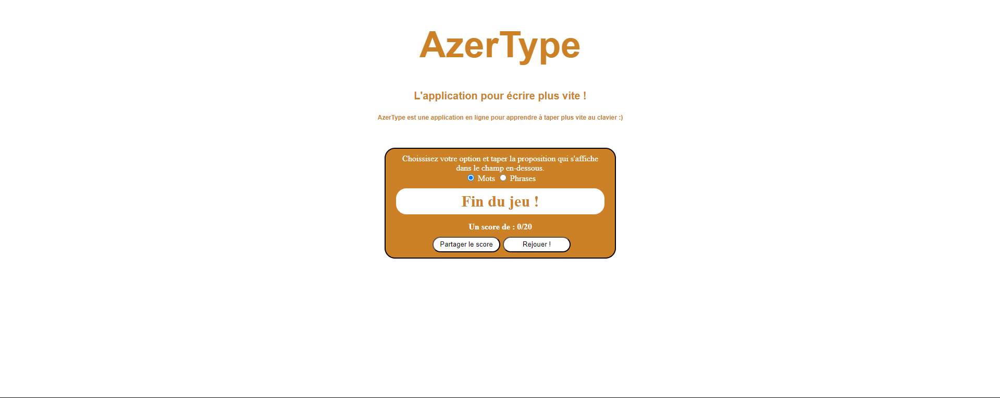

# AzerType
### L'application pour écrire plus vite !
> Cette application a été développée dans le cours 'Apprenez à programmer avec JavaScript' sur OpenClassrooms.

### Le but du jeu : 
> Veuillez sélectionner votre mode de jeu, soit "Mots" soit "Phrases". Une liste vous sera proposée, et vous devrez la recopier avant d'appuyer sur "Valider" pour passer au mot ou à la phrase suivante. Une fois la liste terminée, vous obtiendrez votre score, que vous pourrez partager !

## Images de présentation : 
#### Début de partie : 

#### Fin de partie : 

#### Partager votre score :

